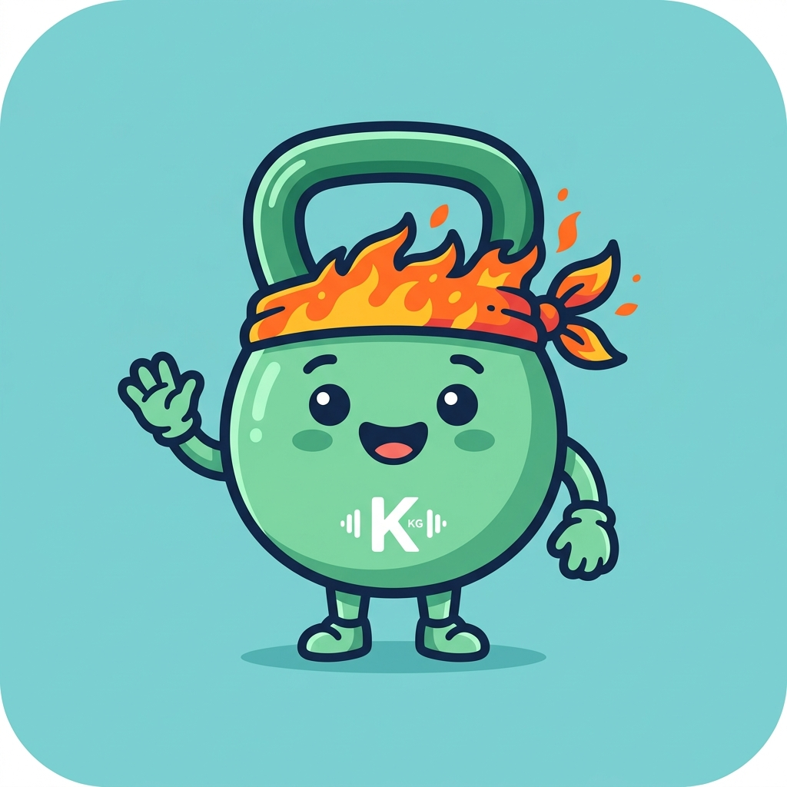

<div align="center">



# FormFit

**AI-Powered Real-Time Exercise Coach & Fitness Companion**

*Biomechanics · Nutrition · Leaderboard · Gamification*

---

[](https://kotlinlang.org/)
[](https://developer.android.com/jetpack/compose)
[](https://developers.google.com/ml-kit/vision/pose-detection)
[](https://ai.google.dev/)
[](https://firebase.google.com/)
[](LICENSE)
[-3DDC84?style=for-the-badge&logo=android&logoColor=white)](https://developer.android.com/)

</div>

---

## What is FormFit?

FormFit turns your Android phone into a professional-grade exercise analysis system. Point the camera at yourself while working out — FormFit detects your body in real time, evaluates your technique on every single rep, and gives you instant feedback so you train smarter, not harder.

Beyond exercise tracking, FormFit includes a Gemini-powered meal scanner for nutrition logging, a live Firebase leaderboard so you compete globally, and a Duolingo-inspired XP + streak system that keeps you motivated day after day.

---

## Feature Overview

<table>
<tr>
<td width="50%">

### 🏋️ Real-Time Exercise Coach
- **BlazePose on-device AI** — 33-landmark body tracking at 30 FPS
- **Biomechanics engines** for Pull-Up and Push-Up
- Joint angle analysis for Squat, Lunge, Plank
- Live form scoring (0–100) per rep
- Instant audio + visual feedback

</td>
<td width="50%">

### 🥗 Smart Nutrition Scanner
- Photograph any meal → instant macro breakdown
- Gemini Vision API for deep semantic analysis
- Local fallback engine works offline
- Daily calorie & macro tracker
- Full meal history by date

</td>
</tr>
<tr>
<td width="50%">

### 🏆 Global Leaderboard
- Live Firebase Firestore competition
- XP syncs automatically after every session
- Custom display names
- Real-time rank updates

</td>
<td width="50%">

### 🎮 Gamification
- XP earned per rep based on form quality
- Level progression system
- Streak tracking (daily workout calendar)
- Badges: First Workout, 7-Day Streak, Form Master, Squat Deity

</td>
</tr>
</table>

---

## Supported Exercises

| Exercise | Engine | Depth |
|---|---|---|
| **Pull-Up** | Full Biomechanics (`PullUpBiomechanics.kt`) | Physics, VBT, Muscle Fatigue, Temperature |
| **Push-Up** | Full Biomechanics (`PushUpBiomechanics.kt`) | Physics, VBT, Muscle Fatigue, Hip Sag Detection |
| **Squat** | Angle + State Machine | Depth, Knee Valgus, Form Score |
| **Lunge** | Angle + State Machine | Depth, Knee Alignment, Form Score |
| **Plank** | Angle Monitor | Hip Alignment, Hold Time |

---

## Architecture

```
FormFit/
├── cv/
│   ├── PoseAnalyzer.kt          # BlazePose landmark → angle → form score pipeline
│   ├── PullUpBiomechanics.kt    # Pull-up physics engine (kinematics, VBT, muscle model)
│   └── PushUpBiomechanics.kt    # Push-up physics engine (kinematics, VBT, muscle model)
│
├── viewmodel/
│   └── WorkoutViewModel.kt      # MVVM state: sessions, XP, reps, biomechanics routing
│
├── ui/screens/
│   ├── DashboardScreen.kt       # Home: stats, streaks, quick-start
│   ├── PracticeScreen.kt        # Camera + pose overlay + exercise HUDs
│   ├── SummaryScreen.kt         # Post-workout analytics
│   ├── NutritionScreen.kt       # Meal logger + Gemini scanner
│   ├── LeaderboardScreen.kt     # Firebase global rankings
│   └── ProfileScreen.kt        # Settings, body params, badges
│
├── data/
│   ├── Database.kt              # Room DB: WorkoutSession, UserStats, NutritionLog
│   ├── Repository.kt            # Data access layer
│   └── FirebaseLeaderboardRepository.kt  # Firestore sync
│
├── api/
│   └── GeminiFoodAnalyzer.kt    # Gemini Vision API for food recognition
│
└── audio/
    └── DuoSoundPlayer.kt        # Duolingo-style feedback sounds
```

### Tech Stack

| Layer | Technology |
|---|---|
| Language | Kotlin 2.0 |
| UI | Jetpack Compose + Material 3 |
| Architecture | MVVM + Clean Architecture |
| Pose Estimation | Google ML Kit BlazePose (on-device TFLite) |
| Camera | CameraX |
| Database | Room (SQLite) |
| Cloud | Firebase Firestore |
| Nutrition AI | Google Gemini Vision API |
| Async | Kotlin Coroutines + StateFlow |

---

## Biomechanics Deep Dive

### How Pull-Up & Push-Up Analysis Works

Both engines follow the same pipeline:

```
Camera Frame
    │
    ▼
BlazePose → 33 Landmarks (X, Y, confidence)
    │
    ▼
PoseSkeleton → filter joints, compute bilateral averages
    │
    ▼
┌─────────────────────────────────────────────────────────────┐
│  Kinematic Engine                                           │
│  • Scale calibration (arm/torso length → px per metre)      │
│  • Velocity from rolling shoulder Y window (EMA filtered)   │
│  • Acceleration from velocity delta / dt                    │
│  • Force = mass × (g + accel)                               │
│  • Power = force × velocity                                 │
└─────────────────────────────────────────────────────────────┘
    │
    ▼
┌─────────────────────────────────────────────────────────────┐
│  State Machine                                              │
│  Pull-Up: HANG → PULL → TOP → LOWER → HANG                  │
│  Push-Up: PLANK → LOWER → BOTTOM → PRESS → PLANK            │
└─────────────────────────────────────────────────────────────┘
    │
    ▼
┌─────────────────────────────────────────────────────────────┐
│  3-Compartment Muscle Fatigue Model                         │
│  mR (rested) → mA (active) → mF (fatigued)                  │
│  + Thermal model: heat generation → temperature rise         │
└─────────────────────────────────────────────────────────────┘
    │
    ▼
PullUpMetrics / PushUpMetrics → ViewModel → HUD overlay
```

### Velocity-Based Training (VBT)

Rep 1 peak concentric velocity establishes a **baseline (vRef)**. Every subsequent rep:

```
Speed Loss % = (1 - currentRepPeakVelocity / vRef) × 100
```

> When speed loss exceeds 20–30%, neuromuscular fatigue is accumulating rapidly — this is your signal to rest or stop the set.

### Muscle Fatigue Model

Each muscle is modelled with 3 fiber pools:

| Pool | Symbol | Meaning |
|---|---|---|
| Rested | `mR` | Available, unfatigued fibers |
| Active | `mA` | Currently recruited fibers |
| Fatigued | `mF` | Fatigued fibers unable to contract |

Transition rates per frame:
- Recruitment: `mR → mA` at rate proportional to activation demand
- Fatigue:     `mA → mF` at rate 0.025/s during exercise
- Recovery:    `mF → mR` at rate 0.005/s (faster at rest)

Effort Index combines fiber state + temperature:
```
effortIndex = 0.9 × (mA + mF) + 0.1 × (ΔTemp / 2.0°C ceiling)
```

---

## Setup & Installation

### Prerequisites

- Android Studio Ladybug (2024.2.1) or newer
- Android device or emulator running API 24+
- Google Gemini API key (free tier available at [ai.google.dev](https://ai.google.dev/))
- Firebase project with Firestore enabled (for leaderboard)

### 1 · Clone the repository

```bash
git clone https://github.com/your-username/formfit.git
cd formfit
```

### 2 · Configure API keys

Copy the example environment file and fill in your keys:

```bash
cp .env.example .env
```

Open `.env` and set:
```
GEMINI_API_KEY=your_gemini_api_key_here
```

Alternatively, enter your Gemini key directly in the app under **Profile → Settings → AI Vision API Key**.

### 3 · Firebase Setup

1. Create a Firebase project at [console.firebase.google.com](https://console.firebase.google.com)
2. Add an Android app with package name `com.example`
3. Download `google-services.json` and place it at `app/google-services.json`
4. Enable **Cloud Firestore** in the Firebase console

### 4 · Build & Run

```bash
./gradlew assembleDebug
```

Or open in Android Studio and press **Run ▶**.

---

## Permissions Required

| Permission | Purpose |
|---|---|
| `CAMERA` | Live pose estimation and food photo capture |
| `INTERNET` | Firebase leaderboard sync + Gemini API calls |

---

## Project Structure — Key Files

| File | Purpose |
|---|---|
| `PullUpBiomechanics.kt` | Full physics engine for pull-up: kinematics, VBT, muscle fatigue, thermal model |
| `PushUpBiomechanics.kt` | Full physics engine for push-up: same depth, push-specific mechanics |
| `PoseAnalyzer.kt` | BlazePose landmark → `PoseSkeleton` → angle-based form evaluation for all exercises |
| `WorkoutViewModel.kt` | Central state: routes camera frames to correct biomechanics engine, manages XP/sessions |
| `PracticeScreen.kt` | Camera preview + ML Kit integration + exercise-specific HUD overlays |
| `GeminiFoodAnalyzer.kt` | Gemini Vision API integration for meal macro estimation |
| `FirebaseLeaderboardRepository.kt` | Reads/writes XP and user data to Firestore |
| `Database.kt` | Room schema: `WorkoutSession`, `UserStats`, `NutritionLog` |

---

## Gamification Formula

```
Session XP =
  20 (base completion bonus)
  + Σ { 5 XP per rep if form score ≥ 80, else 2 XP }
  + 30 (high-form bonus if avg score ≥ 90% AND reps ≥ 5)

Level threshold = 100 XP per level (linear)
```

---

## Roadmap

- [ ] Bicep Curl biomechanics engine
- [ ] Shoulder Press biomechanics engine  
- [ ] Deadlift posture analysis (hip hinge angle)
- [ ] Full rep-by-rep post-workout analytics page
- [ ] Offline leaderboard cache
- [ ] Custom workout plan builder
- [ ] Apple HealthKit / Google Health Connect integration

---

## Contributing

Pull requests are welcome. For major changes, open an issue first to discuss what you'd like to change.

1. Fork the repository
2. Create a feature branch: `git checkout -b feature/exercise-name-biomechanics`
3. Commit your changes: `git commit -m 'Add bicep curl biomechanics engine'`
4. Push to the branch: `git push origin feature/exercise-name-biomechanics`
5. Open a pull request

---

## License

This project is licensed under the MIT License — see [LICENSE](LICENSE) for details.

---

<div align="center">

Built with ❤️ using Kotlin · Jetpack Compose · Google ML Kit · Gemini AI

</div>
